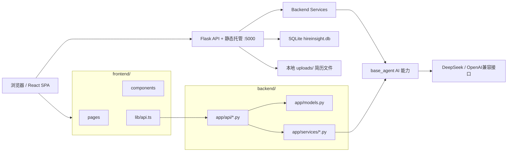
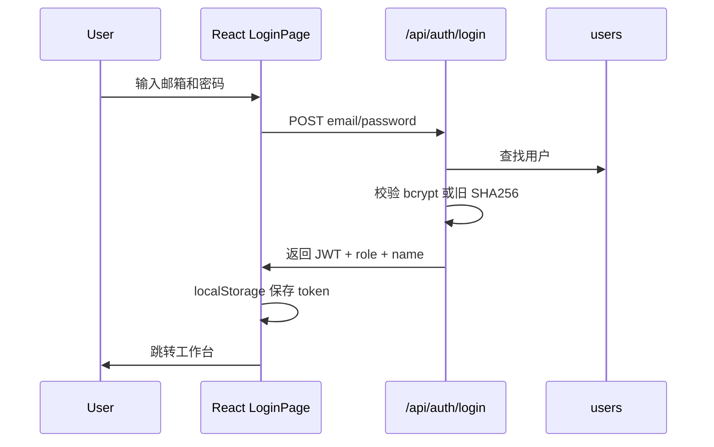
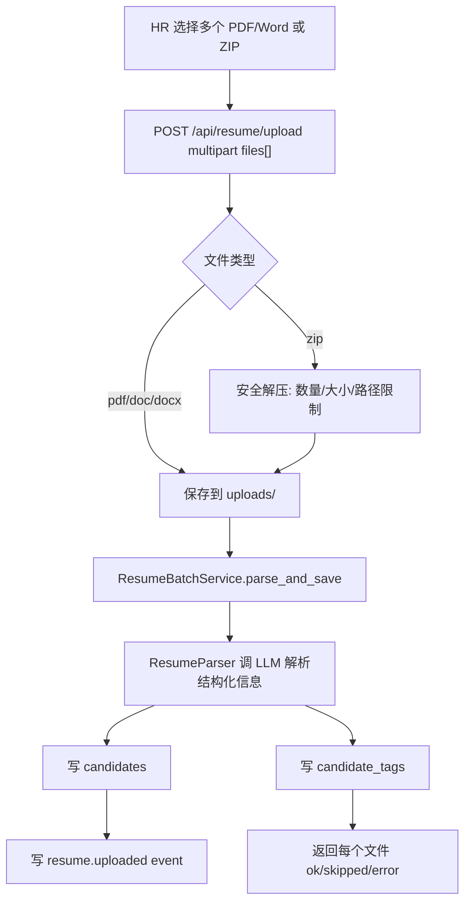

# 智聘招聘系统 As-built SDD v1.0

> As-built SDD = 根据当前已实现系统反推的系统设计文档。
> 本文用于后续迭代开发、模块定位、影响范围评估和交接，不等同于最初立项时的需求文档。

## 1. 文档基准

| 项目 | 内容 |
|---|---|
| 系统名称 | 智聘 · 招聘管理系统 |
| 文档类型 | As-built System Design Document |
| 代码基准 | `main` 分支，当前 HEAD: `6a26afe Merge feat/pipeline-stage-management:招聘流程补全 M1-M5(PRD G1-G10)` |
| 本地项目路径 | `/Users/yenns/Desktop/智聘` |
| 主要用途 | 后续按模块指定改动时，用来快速判断要改哪些文件、影响哪些接口/表/流程 |
| 文档生成日期 | 2026-06-19 |

### 1.1 本地兼容补丁说明

当前本地代码除云端 `main` 外，还保留了几处运行兼容补丁：

| 文件 | 目的 |
|---|---|
| `backend/app/api/auth.py` | 兼容旧演示数据库中的 SHA256 密码；公开注册默认关闭，试点账号由 admin 分配 |
| `base_agent/llm_client.py` | 支持 `keychain:<service>` 形式读取 macOS 钥匙串中的 API Key |
| `base_agent/resume_parser.py` | 简历解析器也支持钥匙串 API Key，避免上传简历时把 `keychain:` 字符串当作真实 key |
| `backend/tests/test_auth_passwords.py` | 覆盖 bcrypt 与旧 SHA256 密码兼容 |
| `base_agent/tests/test_llm_client_secrets.py` | 覆盖钥匙串密钥解析和简历解析器密钥路径 |
| `backend/migrate_stages.py` | 将历史一面/二面/终面主流程阶段归并为当前 MVP 的 `interview` |

这些补丁是为了让本地演示环境稳定运行。若后续要推到云端，应作为单独 PR 合入，并同步更新 `.env.example` / 部署文档。

## 2. 系统目标

智聘是一个面向招聘团队的内部招聘管理系统，核心目标是把“简历进入、岗位管理、候选人匹配、流程推进、AI 面试、BI 看板”串成一条可操作的招聘闭环。

### 2.1 核心能力

| 能力 | 当前状态 | 说明 |
|---|---|---|
| 登录与角色权限 | 已实现 | JWT + RBAC，角色包括 admin / manager / recruiter / interviewer |
| 候选人库 | 已实现 | 列表、详情、技能标签、候选人归属 |
| 简历上传解析 | 已实现 | PDF / Word / ZIP 批量上传，AI 解析入库 |
| 岗位管理 | 已实现 | 创建、编辑、关闭岗位，JD AI 结构化与澄清追问 |
| 智能匹配 | 已实现 | 岗位找候选人，生成匹配分、命中标签、缺失标签 |
| 候选人管道 | 已实现 | pending → ai_screen → business_review → interview → offer → onboarded/rejected |
| AI 面试 | 已实现 | 生成题目、提交回答、AI 评分、报告落库、预筛后回写流程 |
| 面试官反馈 | 已实现 | 按轮次写反馈，支持固定原因分类，进入候选人 journey |
| BI 看板 | 已实现 | 团队漏斗、专员效能、岗位漏斗 |
| AI 助手 | 已实现 | LangGraph ReAct 工具调用，支持读工具与用户确认后的写工具 |
| 用户管理 | 已实现 | admin 管理用户角色、启停、创建账号与重置密码 |

### 2.2 明确不做或尚未工程化的能力

| 项目 | 当前状态 |
|---|---|
| 多租户隔离 | 未实现 |
| 生产级审计合规 | 部分事件表，未形成完整审计系统 |
| 异步任务队列 | 配置了 Celery eager，但当前上传/AI 多为同步处理 |
| 搜索索引 | 未实现，主要通过数据库查询 |
| 大规模批量导入队列 | 未实现，当前批量上传在请求中同步解析 |
| 文件对象存储 | 未实现，简历原文件保存在本地上传目录 |

## 3. 总体架构



### 3.1 技术栈

| 层 | 技术 |
|---|---|
| 前端 | React, TypeScript, Vite, Tailwind CSS, lucide-react, GSAP |
| 后端 | Flask, Flask-SQLAlchemy, Flask-CORS, PyJWT, bcrypt |
| 数据库 | SQLite 开发/演示；文档预留 PostgreSQL 生产替换 |
| AI | `base_agent/llm_client.py`，OpenAI 兼容 Chat Completions，当前配置 DeepSeek |
| 智能体 | LangGraph ReAct 循环，SSE 流式输出 |
| 部署 | Flask 单端口托管 `frontend/dist`；也支持 gunicorn |

### 3.2 单端口部署模式

后端 `backend/app/__init__.py` 注册了 API 蓝图，同时把 `frontend/dist` 作为 SPA 静态文件托管：

| 路径 | 处理方式 |
|---|---|
| `/api/*` | Flask 蓝图 API |
| `/assets/*` | 返回前端构建产物 |
| `/login`、`/candidates` 等前端路由 | 回退 `frontend/dist/index.html` |

这意味着本地生产式运行只需要：

```bash
cd frontend
npm run build

cd ../backend
python run.py
```

或使用 gunicorn：

```bash
cd backend
gunicorn -w 2 -b 0.0.0.0:5000 --timeout 120 --keep-alive 5 "run:app"
```

## 4. 目录结构与职责

| 路径 | 责任 |
|---|---|
| `frontend/src/App.tsx` | 前端路由与角色级页面守卫 |
| `frontend/src/lib/api.ts` | 所有前端 API 调用、JWT 注入、401 处理 |
| `frontend/src/lib/auth.tsx` | 登录态、token、角色信息 |
| `frontend/src/lib/nav.ts` | 侧边导航与角色可见性 |
| `frontend/src/pages/*` | 页面级功能 |
| `frontend/src/components/*` | 通用 UI、业务组件、看板组件 |
| `backend/run.py` | 后端启动入口 |
| `backend/app/__init__.py` | Flask app、蓝图注册、前端静态托管 |
| `backend/app/config.py` | 环境变量、数据库、上传目录、JWT、Celery 配置 |
| `backend/app/models.py` | 数据模型定义 |
| `backend/app/api/*.py` | REST API 层 |
| `backend/app/services/*.py` | 业务服务层，封装匹配、简历、面试、AI 助手等 |
| `backend/app/middleware/auth.py` | JWT 校验与 RBAC 装饰器 |
| `backend/app/middleware/events.py` | 写操作事件埋点 |
| `base_agent/llm_client.py` | LLM 请求、模型路由、密钥读取 |
| `base_agent/resume_parser.py` | 简历解析与技能标签抽取 |
| `base_agent/job_matcher.py` | 岗位-候选人匹配算法 |
| `backend/seed_dev.py` | 演示数据重置脚本 |
| `frontend/dist/` | 前端生产构建产物，由 Flask 托管 |

## 5. 角色与权限模型

| 角色 | 可见模块 | 主要权限 |
|---|---|---|
| `admin` | 全部模块 | 用户管理、BI、候选人、岗位、流程、面试、AI 助手 |
| `manager` | 工作台、AI 助手、候选人、上传、岗位、流程、面试、BI | 团队视角管理、候选人转派、BI 查看 |
| `recruiter` | 工作台、AI 助手、候选人、上传、岗位、流程、面试 | 负责自己的候选人和招聘操作 |
| `interviewer` | 工作台、我的面试、候选人详情 | 只处理分配给自己的面试安排与反馈；不浏览全量简历库、不推进候选人管道、不使用 AI 助手 |

### 5.1 前端路由守卫

前端入口：`frontend/src/App.tsx`

| 路由 | 页面 | 角色 |
|---|---|---|
| `/login` | `LoginPage` | 未登录 |
| `/` | `DashboardPage` | 全部登录角色 |
| `/agent` | `AgentPage` | recruiter / manager / admin |
| `/candidates` | `CandidatesPage` | recruiter / manager / admin |
| `/candidates/:id` | `CandidateProfilePage` | recruiter / manager / admin / interviewer |
| `/upload` | `UploadPage` | recruiter / manager / admin |
| `/jobs` | `JobsPage` | recruiter / manager / admin |
| `/jobs/:id/match` | `JobMatchPage` | recruiter / manager / admin |
| `/pipeline` | `PipelinePage` | recruiter / manager / admin |
| `/interviews` | `InterviewListPage` | recruiter / interviewer / manager / admin |
| `/interviews/new` | `InterviewsPage` | recruiter / manager / admin |
| `/interviews/:id` | `InterviewReportPage` | recruiter / manager / admin / interviewer |
| `/bi` | `BiPage` | manager / admin |
| `/admin/users` | `UsersPage` | admin |

### 5.2 后端权限

后端使用 `require_auth` 解 JWT，把 `user_id` 与 `role` 写入 Flask `g`。部分接口通过 `require_role(...)` 限制角色。

需要注意：

- 前端隐藏菜单不是安全边界，后端 RBAC 才是安全边界。
- `recruiter` 在候选人列表与候选人 journey 上受归属限制。
- `admin` 不能停用或降级自己的账号。

## 6. 数据模型

源文件：`backend/app/models.py`

| 表 | 模型 | 关键字段 | 用途 |
|---|---|---|---|
| `users` | `User` | `name`, `email`, `role`, `password_hash`, `is_active` | 用户、角色、启停 |
| `candidates` | `Candidate` | `owner_hr_id`, `name_masked`, `resume_json`, `raw_file_path` | 候选人主档与简历结构化结果 |
| `candidate_tags` | `CandidateTag` | `candidate_id`, `tag`, `score` | 简历技能标签及评分 |
| `jobs` | `Job` | `title`, `jd_text`, `jd_structured`, `owner_hr_id`, `status` | 岗位主档与结构化 JD |
| `matches` | `Match` | `job_id`, `candidate_id`, `score`, `reason` | 持久化的岗位匹配结果 |
| `interviews` | `Interview` | `candidate_id`, `job_id`, `qa_json`, `ai_report`, `score`, `pass_recommended` | AI 面试记录与评分 |
| `pipeline_stages` | `PipelineStage` | `candidate_id`, `job_id`, `stage`, `updated_by`, `note`, `ts` | 招聘流程流水，append-only |
| `events` | `Event` | `actor_id`, `action`, `entity_id`, `entity_type`, `payload` | 写操作事件，用于 BI 与审计基础 |
| `audit_logs` | `AuditLog` | `actor_id`, `target_table`, `target_id`, `action` | 预留审计表，当前使用较少 |
| `interview_feedback` | `InterviewFeedback` | `candidate_id`, `job_id`, `round`, `interviewer_id`, `score`, `passed`, `reason_tags`, `note` | 面试官反馈与原因分类 |

### 6.1 招聘阶段枚举

当前合法阶段：

```text
pending
ai_screen
business_review
interview
offer
onboarded
rejected
```

主流程顺序定义在 `backend/app/api/pipeline.py` 和 `frontend/src/lib/pipelineStages.ts`。新增阶段时必须两边同步。

历史兼容：`interview_first` / `interview_second` / `interview_final` 仍可被后端读取并归并展示为 `interview`，但新写入的候选人管道主流程不应再生成这些旧阶段。面试第几轮通过 `interview_feedback.round`、面试安排和面试记录表达，不再作为管道主阶段。

### 6.2 PipelineStage 的重要设计

`pipeline_stages` 是 append-only 流水表，不是“当前状态表”。候选人每推进一次就新增一行。查询当前阶段时必须取每个 `(candidate_id, job_id)` 的最新一行。

影响点：

| 改动 | 风险 |
|---|---|
| 直接按 `stage` group by | 会把历史阶段重复计入漏斗 |
| 删除历史阶段 | 会破坏 candidate journey 与 BI |
| 新增阶段 | 必须同步 `VALID_STAGES`、`STAGE_ORDER`、前端阶段配置、测试 |

## 7. 核心 API 清单

所有接口都挂在 `/api` 下。

### 7.1 Auth

| 方法 | 路径 | 权限 | 作用 |
|---|---|---|---|
| `POST` | `/auth/register` | 无 | 公开注册入口，默认关闭；试点账号由 admin 创建 |
| `POST` | `/auth/login` | 无 | 登录，返回 JWT、角色、姓名 |
| `GET` | `/auth/me` | 登录 | 获取当前用户 |
| `POST` | `/auth/change-password` | 登录 | 修改当前用户密码 |

### 7.2 Resume / Candidate

| 方法 | 路径 | 权限 | 作用 |
|---|---|---|---|
| `POST` | `/resume/upload` | 登录 | 批量上传 PDF / Word / ZIP 简历，AI 解析入库 |
| `GET` | `/resume/<candidate_id>` | 登录 | 候选人简历详情与技能标签 |
| `GET` | `/candidates` | 登录 | 候选人列表，recruiter 只看自己的 |
| `GET` | `/candidates/<id>/pipelines` | 登录 | 候选人参与的岗位流程 |
| `GET` | `/candidates/<id>/journey?job_id=` | 登录 | 候选人某岗位下的完整时间线、AI 面试、面试官反馈 |
| `PATCH` | `/candidates/<id>/owner` | manager/admin | 转派候选人负责人 |

### 7.3 Jobs / Match

| 方法 | 路径 | 权限 | 作用 |
|---|---|---|---|
| `POST` | `/jobs/clarify` | 登录 | AI 根据 JD 生成澄清追问，不落库 |
| `POST` | `/jobs` | 登录 | 创建岗位，AI 结构化 JD |
| `GET` | `/jobs` | 登录 | active 岗位列表 |
| `GET` | `/jobs/<job_id>` | 登录 | 岗位详情 |
| `PUT` | `/jobs/<job_id>` | owner/manager/admin | 编辑岗位，JD 变化时重新结构化 |
| `POST` | `/jobs/<job_id>/close` | owner/manager/admin | 关闭岗位 |
| `POST` | `/jobs/<job_id>/match` | 登录 | 运行岗位候选人匹配并持久化 |
| `POST` | `/match` | 登录 | 兼容旧入口，按 `job_id` 运行匹配 |

### 7.4 Pipeline

| 方法 | 路径 | 权限 | 作用 |
|---|---|---|---|
| `POST` | `/pipeline/move` | recruiter/manager/admin；interviewer 禁止 | 推进候选人到某阶段，写流水与事件 |
| `GET` | `/pipeline/<job_id>` | 登录 | 某岗位当前阶段人数 |
| `GET` | `/pipeline/<job_id>/board` | 登录 | 某岗位看板候选人卡片数据 |
| `GET` | `/pipeline/<job_id>/history/<candidate_id>` | 登录 | 候选人某岗位流程历史 |

### 7.5 Interview

| 方法 | 路径 | 权限 | 作用 |
|---|---|---|---|
| `POST` | `/interview/start` | 登录 | 生成 AI 面试题 |
| `POST` | `/interview/submit` | 登录 | 提交回答，AI 评分，报告落库，并可能回写流程 |
| `GET` | `/interview/<interview_id>` | 登录 | AI 面试报告详情 |
| `POST` | `/interview/feedback` | 登录 | 面试官提交反馈，可带 `reason_tags` 原因分类 |
| `GET` | `/interview/feedback` | 登录 | 查询反馈，返回原因分类 |
| `GET` | `/interviews` | 登录 | 面试记录列表，按角色过滤 |

### 7.6 BI / Admin / Agent

| 方法 | 路径 | 权限 | 作用 |
|---|---|---|---|
| `GET` | `/bi/overview` | manager/admin | 团队漏斗、专员效能、面试官责任、用人部门责任 |
| `GET` | `/bi/staff/<hr_id>` | 登录，recruiter 仅自己 | 单专员漏斗 + `performance` 个人绩效行 |
| `GET` | `/bi/job/<job_id>` | 登录 | 单岗位漏斗 |
| `GET` | `/admin/users` | admin | 用户列表 |
| `POST` | `/admin/users` | admin | 创建试点账号 |
| `PATCH` | `/admin/users/<user_id>` | admin | 修改角色、启停 |
| `POST` | `/admin/users/<user_id>/reset-password` | admin | 重置用户密码 |
| `GET` | `/agent/tools` | 登录 | AI 助手工具清单 |
| `POST` | `/agent/chat` | 登录 | SSE 流式 AI 对话 |
| `POST` | `/agent/execute` | 登录 + 工具 RBAC | 执行 AI 助手提议的写操作 |

## 8. 核心业务流程

### 8.1 登录流程



后续所有 API 请求由 `frontend/src/lib/api.ts` 注入 `Authorization: Bearer <token>`。

### 8.2 简历批量导入流程

入口：

- 前端：`frontend/src/pages/UploadPage.tsx`
- API client：`frontend/src/lib/api.ts` 的 `uploadResumes(files)`
- 后端：`backend/app/api/resume.py`
- 服务：`backend/app/services/resume_service.py`
- AI：`base_agent/resume_parser.py`



安全限制：

| 项目 | 限制 |
|---|---|
| 支持格式 | `.pdf`, `.doc`, `.docx`, `.zip` |
| ZIP 文件条目 | 最多 100 条 |
| ZIP 内单文件 | 20MB |
| ZIP 解压总大小 | 200MB |
| Flask 单请求大小 | 100MB |

风险边界：

- 该流程会调用 LLM，会写入候选人库和标签表。
- 当前是同步解析，大批量简历可能导致请求等待较久。
- 个别文件失败不影响同批其他文件。

### 8.3 岗位创建与 JD 结构化

入口：

- 前端：`frontend/src/pages/JobsPage.tsx`
- 后端：`backend/app/api/jobs.py`
- AI：`base_agent/llm_client.py`

流程：

1. 用户输入岗位名称与 JD。
2. 可先调用 `/jobs/clarify` 生成澄清追问，不落库。
3. 创建岗位时，后端将 JD 与澄清补充合并。
4. LLM 输出结构化 JD，写入 `jobs.jd_structured`。
5. 岗位默认 `status=active`。

影响面：

- `jd_structured.skill_tags_raw` 直接影响后续匹配。
- 修改 JD 会重新结构化。
- 关闭岗位只改 `status=closed`，不物理删除。

### 8.4 岗位候选人匹配

入口：

- 前端：`frontend/src/pages/JobMatchPage.tsx`
- 后端：`backend/app/services/match_service.py`
- 算法：`base_agent/job_matcher.py`

流程：

1. 从 `jobs.jd_structured.skill_tags_raw` 解析岗位技能要求。
2. 从 `candidate_tags` 读取候选人技能。
3. 计算匹配分、命中标签、缺失标签。
4. 结果按分数降序。
5. `/jobs/<id>/match` 会清理该岗位旧 match 记录并写入新的 top N。

风险边界：

- 修改标签结构会影响匹配。
- 修改 `job_matcher.py` 会影响岗位匹配页面和 AI 助手工具。
- 只读匹配和持久化匹配要区分：AI 助手读工具使用只读模式。

### 8.5 候选人管道推进

入口：

- 前端：`frontend/src/pages/PipelinePage.tsx`
- 看板组件：`frontend/src/components/pipeline/*`
- 后端：`backend/app/api/pipeline.py`

流程：

1. 用户选择岗位。
2. 拉取 `/pipeline/<job_id>/board`。
3. 看板按最新阶段渲染候选人。
4. 用户移动阶段，调用 `/pipeline/move`。
5. 后端向 `pipeline_stages` append 新流水，并写 `pipeline.moved` 事件。
6. 如果目标为 `onboarded`，额外写 `candidate.onboarded` 事件。

重要约束：

- `rejected` 是终态，但当前代码没有强限制不允许再次移动。
- 主流程阶段为 `pending → ai_screen → business_review → interview → offer → onboarded/rejected`。
- 历史一面/二面/终面阶段只做兼容读取，新写入统一使用 `interview`。
- 阶段移动由 HR/经理/管理员完成；面试官账号即使被分配了面试，也不能调用 `/pipeline/move` 直接推进 Offer 或淘汰。
- 前端反馈表通过 `canMovePipeline` 控制按钮显示，后端 `/pipeline/move` 也会兜底拦截面试官账号。

### 8.6 AI 面试与流程回写

入口：

- 前端：`frontend/src/pages/InterviewsPage.tsx`
- 后端：`backend/app/api/interview.py`
- 服务：`backend/app/services/interview_service.py`

流程：

1. `/interview/start` 根据岗位 JD 生成题目。
2. 用户提交问答对到 `/interview/submit`。
3. LLM 对每个回答评分。
4. 生成平均分与 `pass_recommended`。
5. 写入 `interviews`。
6. 若通过且候选人尚未到面试中或更后阶段，流程推进到 `interview`。
7. 若不通过，流程推进到 `rejected`。

关键规则：

- AI 通过时不会把已经在面试中或更后阶段的候选人回退。
- AI 未通过会写 `rejected`。
- 这是会自动写主流程状态的 AI 行为，风险高于只读建议型 AI。

### 8.7 面试官反馈

入口：

- 前端：`frontend/src/components/interview/FeedbackForm.tsx`
- 后端：`backend/app/api/interview.py`

面试官反馈写入 `interview_feedback`，候选人详情 journey 会聚合展示流程时间线、AI 面试记录和面试官反馈。面试官在“我的面试”中只提交反馈；候选人是否进入 Offer 或淘汰，由 HR/经理/管理员在候选人管道中处理。

`reason_tags` 用于 MVP 试点阶段的责任归因，前端提供固定原因分类，例如专业能力不匹配、项目经验不足、薪资期望不匹配、候选人已接受其他机会、面试时间无法协调、岗位画像变化、部门内部意见不一致、面试标准变化、HC 暂缓或冻结、岗位暂停招聘、需要加面确认等。后端只保存白名单内原因，避免自由文本污染后续 BI 口径。

### 8.8 BI 看板

入口：

- 前端：`frontend/src/pages/BiPage.tsx`
- 后端：`backend/app/api/bi.py`

BI 主要从两类数据计算：

| 来源 | 用途 |
|---|---|
| `pipeline_stages` 最新阶段 | 漏斗各阶段人数 |
| `candidates.owner_hr_id` + `pipeline_stages` | 招聘专员有效推荐、推荐成功面试、Offer、入职等个人绩效 |
| `interview_assignments` | 面试安排、面试官、轮次、待补反馈 |
| `interview_feedback` | 面试通过/拒绝、评分、面试官反馈 |
| `jobs.department` | 用人部门责任归属 |

注意：BI 使用最新阶段去重，不能直接统计所有历史流水。
面试轮次只作为面试事实明细参与 BI 责任归因，不重新拆回候选人管道主流程。
招聘专员工作台的“我的本月业绩”和“今日待办”复用 `/bi/staff/<hr_id>` 的 `performance` 字段；主管 BI 的专员列表也使用同一套公开绩效字段。

### 8.9 AI 助手

入口：

- 前端：`frontend/src/pages/AgentPage.tsx`
- 后端 API：`backend/app/api/agent.py`
- 服务：`backend/app/services/agent_service.py`

AI 助手分两类工具：

| 类型 | 示例 | 是否直接写库 |
|---|---|---|
| 只读工具 | list_candidates, get_candidate, list_jobs, match_candidates_for_job, get_pipeline, get_bi_overview, count_summary, web_search | 否 |
| 写工具 | create_job, move_pipeline, start_interview, run_match | 是，但需要 `/agent/execute` 与 RBAC |

设计原则：

- 对话用 SSE 流式返回。
- AI 可提议写操作，但写操作应由用户确认后调用 `/agent/execute`。
- 写工具内部做 RBAC 校验。

## 9. AI 模块边界

### 9.1 依赖 LLM 的功能

| 功能 | 入口 | 写库 | 风险等级 |
|---|---|---:|---|
| 简历解析 | `/resume/upload` | 是 | 高 |
| JD 结构化 | `/jobs`, `/jobs/<id>` 更新 | 是 | 中 |
| JD 澄清追问 | `/jobs/clarify` | 否 | 低 |
| AI 面试题生成 | `/interview/start` | 只写 event | 中 |
| AI 面试评分 | `/interview/submit` | 是，且可能改流程 | 高 |
| AI 助手问答 | `/agent/chat` | 否 | 中 |
| AI 助手写工具 | `/agent/execute` | 是 | 高 |

### 9.2 密钥与模型配置

配置入口：

- `backend/.env`
- `base_agent/llm_client.py`
- `base_agent/llm_config.json`

当前本地目标配置：

```env
LLM_PROVIDER=deepseek
LLM_MODEL=deepseek-v4-flash
LLM_THINKING=disabled
OPENAI_API_KEY=keychain:zhipin-deepseek-api-key
DEEPSEEK_API_KEY=keychain:zhipin-deepseek-api-key
API_KEY=keychain:zhipin-deepseek-api-key
LLM_API_KEY=keychain:zhipin-deepseek-api-key
```

原则：

- 不把真实 API Key 写入仓库。
- `keychain:` 是本地兼容扩展，合入云端前应更新文档。
- DeepSeek v4 flash 默认给 `max_tokens=8192`，避免推理模型空输出。

### 9.3 新增 AI 行为的安全分级

| 类型 | 建议实现方式 |
|---|---|
| 只读分析 | 新增独立接口或 AI 助手只读工具，不写库 |
| 生成建议 | 返回给前端展示，用户确认后再保存 |
| 写入主数据 | 新增测试，明确影响表，保留回滚路径 |
| 改流程状态 | 必须写业务规则测试，避免自动回退或误淘汰 |
| 改简历解析结构 | 同步候选人详情、匹配、BI、历史数据兼容 |

## 10. 后续改动定位表

### 10.1 只改前端风格

通常只动：

| 需求 | 文件 |
|---|---|
| 全局颜色、字体、间距 | `frontend/src/index.css`, Tailwind 配置 |
| 页面布局 | `frontend/src/pages/*.tsx` |
| 通用按钮/卡片/表单 | `frontend/src/components/ui/*` |
| 侧边导航 | `frontend/src/components/AppShell.tsx`, `frontend/src/lib/nav.ts` |
| 构建产物 | `frontend/dist/*`，由 `npm run build` 生成 |

不应触碰：

- `backend/app/*`
- `base_agent/*`
- `backend/hireinsight.db`
- `backend/.env`

### 10.2 常见功能改动索引

| 想改的地方 | 前端入口 | 后端入口 | 数据/AI 影响 |
|---|---|---|---|
| 登录页视觉 | `frontend/src/pages/LoginPage.tsx` | 无 | 无 |
| 导航菜单 | `frontend/src/lib/nav.ts`, `AppShell.tsx` | 可能无 | 若新路由需同步权限 |
| 候选人列表 | `CandidatesPage.tsx` | `api/candidates.py` | `candidates`, `candidate_tags` |
| 候选人详情 | `CandidateProfilePage.tsx` | `api/resume.py`, `api/candidates.py` | `resume_json`, tags, journey |
| 简历批量上传 | `UploadPage.tsx` | `api/resume.py`, `services/resume_service.py` | 会调用 `resume_parser.py` 并写候选人 |
| 简历解析字段 | `CandidateProfilePage.tsx` | `services/resume_service.py` | 高风险，影响 `resume_json` 兼容 |
| 岗位列表/编辑 | `JobsPage.tsx` | `api/jobs.py` | `jobs.jd_structured` |
| JD AI 澄清 | `JobsPage.tsx` | `api/jobs.py` | LLM，只读或写结构化 |
| 岗位匹配 | `JobMatchPage.tsx` | `services/match_service.py` | `candidate_tags`, `matches`, `job_matcher.py` |
| 候选人管道 | `PipelinePage.tsx`, `components/pipeline/*` | `api/pipeline.py` | `pipeline_stages`, `events` |
| 新增招聘阶段 | `frontend/src/lib/pipelineStages.ts` | `models.py`, `api/pipeline.py` | 高风险，需测试 |
| AI 面试 | `InterviewsPage.tsx`, `InterviewReportPage.tsx` | `api/interview.py`, `services/interview_service.py` | LLM + `interviews` + 流程回写 |
| 面试官反馈 | `FeedbackForm.tsx` | `api/interview.py` | `interview_feedback.reason_tags` |
| BI 看板 | `BiPage.tsx`, `components/bi/*` | `api/bi.py` | `events`, `pipeline_stages` |
| AI 助手 | `AgentPage.tsx`, `lib/agent.ts` | `api/agent.py`, `services/agent_service.py` | 取决于工具，写工具风险高 |
| 用户管理 | `pages/admin/UsersPage.tsx` | `api/admin.py` | `users` |

## 11. 变更影响矩阵

| 改动类型 | 风险 | 是否可能牵动后端 | 是否可能牵动数据库 | 必须验证 |
|---|---:|---:|---:|---|
| 颜色/字体/间距 | 低 | 否 | 否 | 前端 build + 页面检查 |
| 页面排版 | 低-中 | 否 | 否 | 前端 build + 角色页面检查 |
| 多显示已有字段 | 中 | 可能 | 否 | 对应 API 返回字段 |
| 新增筛选/排序 | 中 | 可能 | 否 | API 查询 + 列表页面 |
| 新增保存字段 | 中-高 | 是 | 是 | 迁移/seed/API/页面 |
| 新增招聘阶段 | 高 | 是 | 可能 | pipeline 全链路测试 |
| 修改简历解析结构 | 高 | 是 | 可能 | 上传、候选人详情、匹配 |
| 修改匹配算法 | 高 | 是 | 否 | 匹配单测 + 岗位匹配页 |
| 新增只读 AI 建议 | 中 | 是 | 否 | LLM fallback + 前端展示 |
| AI 自动写库/改流程 | 高 | 是 | 是/间接 | 业务规则测试 + 回滚策略 |

## 12. 数据基线与当前偏差

### 12.1 文档/seed/本地库现状

| 来源 | 观察 |
|---|---|
| `RUNNING.md` | 描述 seed 后应有 29 用户、20 候选人、14 岗位 |
| 当前 `backend/seed_dev.py` 静态定义 | 6 用户、10 候选人、4 岗位 |
| 当前本地 `backend/hireinsight.db` 快照 | 30 用户、21 候选人、14 岗位，13 active + 1 closed |

这说明当前演示数据存在历史恢复与本地使用痕迹。后续若要让“新克隆仓库直接可用”，需要明确选择一种方案：

1. 提交标准演示数据库文件。
2. 或修正 `seed_dev.py`，让它真的生成目标数据。
3. 或在部署脚本里从固定 artifact 恢复数据库。

不要在未确认的情况下随意运行 `seed_dev.py`，因为它会清空并重建 seeded tables。

### 12.2 当前本地数据库快照

生成本文时，本地库统计为：

| 项 | 数量 |
|---|---:|
| users | 30 |
| candidates | 21 |
| jobs | 14 |
| pipeline_stages | 40 |
| interviews | 4 |
| interview_feedback | 0 |
| events | 53 |
| matches | 59 |

这些数字只是当前本地环境快照，不应被视为产品设计约束。

## 13. 非功能需求

| 类别 | 当前实现 | 后续建议 |
|---|---|---|
| 性能 | 中小规模内部工具可用；AI 请求同步等待 | 上传/AI 改为异步任务，前端轮询或 SSE |
| 可用性 | 单进程/单机运行 | 生产使用 gunicorn + supervisor/systemd |
| 数据可靠性 | SQLite 本地文件 | 生产换 PostgreSQL，增加备份 |
| 安全 | JWT + RBAC + 密钥隐藏；弱 demo 密码 | 生产更换 JWT_SECRET、禁用弱密码、加 HTTPS |
| 可观测性 | access log + events 表 | 增加结构化日志、错误监控、慢请求监控 |
| 扩展性 | 模块清晰，但部分业务同步耦合 | AI 与批处理拆异步队列 |
| 合规 | 简历包含个人信息，当前只做脱敏字段展示 | 增加数据留存、删除、导出、访问审计策略 |

## 14. 关键架构决策 ADR 摘要

### ADR-001: 使用 Flask 单端口托管 API 与前端 SPA

| 项 | 内容 |
|---|---|
| 状态 | Accepted |
| 决策 | Flask 同时提供 `/api/*` 和 `frontend/dist` 静态文件 |
| 好处 | 部署简单、本地演示稳定、避免 CORS 与多端口切换 |
| 代价 | 静态资源托管和 API 共进程，生产伸缩粒度较粗 |

### ADR-002: 使用 SQLite 作为开发/演示数据库

| 项 | 内容 |
|---|---|
| 状态 | Accepted for dev/demo |
| 决策 | 默认 `backend/hireinsight.db`，生产可改 `DATABASE_URL` |
| 好处 | 启动简单、无需外部数据库 |
| 代价 | 并发、备份、迁移、远程部署能力有限 |

### ADR-003: 复用 base_agent 承载 AI 能力

| 项 | 内容 |
|---|---|
| 状态 | Accepted |
| 决策 | 后端服务通过 `sys.path` 引入 `base_agent` 中的 LLM、简历解析、匹配算法 |
| 好处 | 复用已有算法与提示词，开发快 |
| 代价 | 包边界不够干净，测试和部署时需保证路径一致 |

### ADR-004: Pipeline 使用 append-only 流水表

| 项 | 内容 |
|---|---|
| 状态 | Accepted |
| 决策 | 每次阶段变化新增 `pipeline_stages` 一行 |
| 好处 | 能保留完整 journey，支持审计与 BI |
| 代价 | 当前状态查询必须取最新行，统计容易踩坑 |

### ADR-005: AI 写操作必须经过显式执行接口

| 项 | 内容 |
|---|---|
| 状态 | Accepted |
| 决策 | AI 助手只提议写操作，前端确认后调用 `/agent/execute` |
| 好处 | 降低 AI 误操作风险 |
| 代价 | 前端需要维护确认交互，工具参数要更严谨 |

## 15. 测试与验证

### 15.1 当前测试入口

| 命令 | 用途 |
|---|---|
| `cd backend && ../.venv/bin/python -m pytest tests -q` | 后端 API 与业务规则测试 |
| `cd base_agent && ../.venv/bin/python -m pytest tests -q` | base_agent 算法/密钥相关测试 |
| `cd frontend && npm run build` | 前端类型与构建验证 |

### 15.2 重要已有测试

| 测试文件 | 覆盖内容 |
|---|---|
| `backend/tests/test_auth_security.py` | 注册角色限制、停用用户登录、空请求 |
| `backend/tests/test_auth_passwords.py` | bcrypt 与旧 SHA256 密码兼容 |
| `backend/tests/test_admin_users.py` | 用户管理权限与自我保护 |
| `backend/tests/test_candidate_journey.py` | 候选人 journey、转派、归属限制 |
| `backend/tests/test_pipeline_rounds.py` | 阶段推进、备注、非法阶段 |
| `backend/tests/test_interview_loop.py` | AI 面试回写流程、面试官反馈 |
| `backend/tests/test_security_hardening_next.py` | 试点权限边界、面试官禁止上传/重解析/推进流程 |
| `frontend/tests/interviewer_role_scope.test.mjs` | 面试官导航、路由、面试工作台与反馈按钮边界 |
| `base_agent/tests/test_job_matcher.py` | 岗位匹配算法 |
| `base_agent/tests/test_llm_client_secrets.py` | keychain 密钥解析 |

### 15.3 改动前验证建议

| 改动 | 至少跑 |
|---|---|
| 只改前端样式 | `npm run build` |
| 改登录/权限 | `pytest tests/test_auth_security.py tests/test_auth_passwords.py -q` |
| 改角色页面/面试官权限 | `pytest tests/test_security_hardening_next.py -q` + `node frontend/tests/interviewer_role_scope.test.mjs` |
| 改候选人/流程 | `pytest tests/test_candidate_journey.py tests/test_pipeline_rounds.py -q` |
| 改 AI 面试 | `pytest tests/test_interview_loop.py -q` |
| 改匹配算法 | `pytest ../base_agent/tests/test_job_matcher.py -q` 或在 base_agent 目录跑 |
| 改密钥/LLMClient | `cd base_agent && ../.venv/bin/python -m pytest tests/test_llm_client_secrets.py -q` |
| 改部署/静态托管 | `npm run build` + 访问 `/login`、登录、打开核心页面 |

## 16. 已知风险与技术债

| 风险 | 影响 | 建议 |
|---|---|---|
| seed 文档、seed 脚本、当前 DB 数量不一致 | 新人部署可能拿不到预期演示数据 | 统一数据策略：提交 DB 或修正 seed |
| 当前上传/AI 解析同步执行 | 批量简历或 LLM 慢时请求等待久 | 引入任务队列与进度接口 |
| SQLite 用作演示库 | 并发和备份能力有限 | 生产使用 PostgreSQL |
| JWT_SECRET 默认值弱 | 生产安全风险 | 生产必须配置强随机密钥 |
| demo 密码弱 | 公网演示风险 | 公网演示后关闭服务或强制改密 |
| AI 面试会自动改流程状态 | 误判会影响主流程 | 保留人工确认或加规则开关 |
| `base_agent` 通过 sys.path 复用 | 包边界不清晰 | 后续可整理为 Python package |
| 事件表不是完整审计 | 追责和合规不足 | 写操作统一审计字段与不可变日志 |
| ZIP 批量导入仍会逐份同步 AI | 大量简历导入慢 | 异步导入、批次 ID、失败重试 |

## 17. 后续文档建议

建议在本 SDD 基础上继续拆出三份轻量文档：

1. `docs/API-智聘-v1.0.md`：更细的接口请求/响应示例。
2. `docs/CHANGE-GUIDE-智聘-v1.0.md`：按“我要改什么”写操作手册。
3. `docs/ADR/`：把本文 ADR 摘要拆成独立决策记录。

## 18. 快速结论

这个系统当前已经具备初版完整闭环。后续迭代时，最安全的策略是：

1. UI 风格改动只动 `frontend/`。
2. 新增只读展示优先复用现有 API。
3. 新增保存字段必须同时设计模型、接口、前端、测试。
4. 新增 AI 行为默认做成旁路建议，不直接写主数据。
5. 如果 AI 要写库或改流程，必须先定义人工确认、回滚方式和测试用例。
